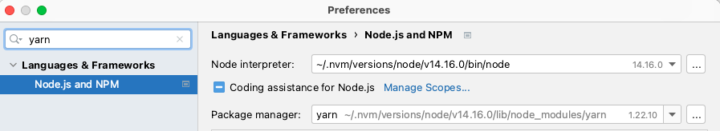
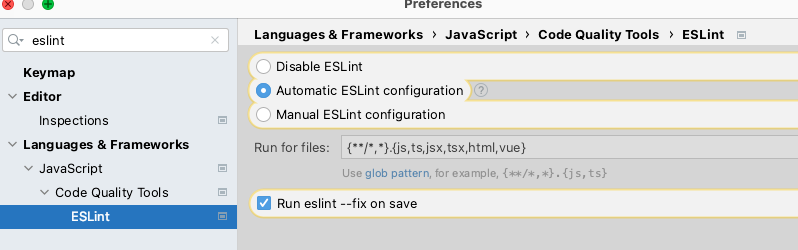

# bynd project setup

## technology stack
- Language : Typescript
- Database : MongoDB
- HTTP Server : Fastify

## table of content

- retrieve the project
- setup your laptop
- setup your IDE
- start the database and external tools
- build and run the project
- populate your database
- test the api

## retrieve the project

if you are reading this, you found the GitHub repository !

checkout the project on your laptop before going to the next step...

## setup your laptop

you will need to setup those tools in order to work in the project :

### Node.js

We recommend using [NVM](https://github.com/nvm-sh/nvm) to manage your node version.
Once you installed nvm, please check the `package.json` to know the correct minimum version of node to install :

```json
{
    "engines": {
        "node": ">=16.4 <17",  // this is the version you need to install
        "npm": ">=7 <8"
    }
}
```

### Docker

In order to run a local database and several tools, you will need to [install docker](https://docs.docker.com/get-docker/) first and [get familiar with it](https://docs.docker.com/get-started/) if necessary 

> You should now be ready to set up your IDE !

## setup your IDE

our top choices as IDE in order to benefit from auto compilation, linter, etc are Intellij/Webstorm and VSCode

### IntelliJ/Webstorm

- setup yarn as package manager for the project :
    - go to the global settings, then `Languages & Frameworks`
    - select you installation of Node.js if necessary
    - select `npm` as package manager (also see [this link](https://www.jetbrains.com/help/idea/installing-and-removing-external-software-using-node-package-manager.html#ws_npm_yarn_configure_package_manager))



- setup eslint
    - go to the global settings, then `Languages & Frameworks` > `Javascript` > `Code Quality Tools` > `ESLint`
    - make sure to check `Automatic ESLint configuration` and `Run eslint --fix on save`



### VSCode

TBD

## start the database and external tools

There is a `support/docker-dev/docker-compose.yml` you can use to start a mongodb redis and smtp server :

```bash
cd support/docker-dev
docker-compose up 
```

Then you will have :
- mongodb running (without password) on port 27017
- smtp running on port 12345
- web interface to see emails running on http://localhost:8085

## build and run the project

### set up the environment

- Setup environment variables before running the api :
```bash
cp .env.tpl .env
```

### build and start

- Build the project (if necessary)
```bash
npm install
npm run build
```

- Start the api
```bash
npm run start:local
```

## populate your database

### method 1 (beginner edition) : using postman, from scratch

> see more about postman in the "test the api section"

:writing_hand: // TODO write here the steps to populate the database

> You should now be ready to use the BE !

### method 2 (power user) : using a custom script

:writing_hand: // TODO if you got no other way to populate the database with a special script

## test the api

- In postman, there is one environment for each deployment :
    - `swag backend - LOCAL`
    - `swag backend - DEV`
    - `swag backend - STAGING`
    
- Change the values of the following variables in your postman env :
```
// todo list here the useful vars to change
```
> :sparkles: tip : use `myname+admin|seller|customer@appstud.com` in order to receive emails in your inbox

- There is several dynamic variables in each postman environments :
    - `foo` // todo described relevant dynamic vars
- In order to set them up before using all the webservices, execute those requests :
    - // todo if there are necessary steps to configure the postman env, described them here
    
> you are now ready to use postman !

> :sparkles: tip : each environment have a separate dynamic variable for the seller/customer/admin JWT token, so there is a distinct seller/customer/seller login request in order to be able to use each webservice without re-login each time
